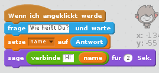

## Ein sprechender Chatbot

Jetzt, wo Du einen Chatbot mit einer eigenen Persönlichkeit hast, lass' uns ihn so programmieren, dass er mit dir spricht.

\--- task \---

Füge deinem Chatbot Code hinzu, so dass er nach deinem Namen fragt und dann sagt: "Was für ein hübscher Name!", wenn er angeklickt wird.

\--- hints \--- \--- hint \---Wenn die Chatbot- **Figur angeklickt wird**, sollte sie nach deinem Namen **fragen**. Der Chatbot sollte dann "Was für ein hübscher Name!" ** sagen **. \--- / hint \--- \--- hint \--- Hier sind die Code-Blöcke, die Du brauchen wirst: <1 /> \--- / hint \--- \--- hint \--- So sollte dein Code aussehen: Code für eine Chatbot-Antwort<2 /> \--- / hint \--- \--- / hint \---

\--- /task \---

\--- task \---

Im Moment antwortet der Chatbot einfach jedes Mal: "Was für ein hübscher Name!". Kannst du die Antwort deines Chatbots persönlicher machen, abhängig von deiner Antwort?

\--- hints \--- \--- hint \---Wenn die Chatbot- **Figur angeklickt wird**, sollte sie nach deinem Namen **fragen**. Der Chatbot sollte dann "Hi", gefolgt von deiner **Antwort** **sagen**. \--- /hint \--- \--- hint \--- Hier sind die Code-Blöcke, die Du brauchen wirst:  \--- /hint \--- \--- hint \--- So sollte dein Code aussehen:  \--- /hint \--- \--- /hints \---

\--- /task \---

\--- task \---

Wenn Du deine Antwort in einer **Variablen** speicherst, kann sie auch später noch verwendet werden. Erstelle eine neue Variable namens `Name` und speichere Deinen Namen darin.

[[[generic-scratch-add-variable]]]

\--- /task \---

\--- task \---

Kannst Du deine Antwort in der Variablen `Name` speichern und so für die Antwort des Chatbots verwenden?

Dein Code sollte wie zuvor funktionieren: dein Chatbot sollte dich mit deinem Namen begrüßen.

\--- hints \--- \--- hint \---Wenn die Chatbot- **Figur angeklickt wird**, sollte sie nach deinem Namen **fragen**. Du solltest dann die Variable `name` auf deine **Antwort** **setzen**. Der Chatbot sollte dann "Hi", gefolgt von deiner **Antwort** **sagen**. \--- /hint \--- \--- hint \--- Hier sind die Code-Blöcke, die Du brauchen wirst:  \--- /hint \--- \--- hint \--- So sollte dein Code aussehen:  \--- /hint \--- \--- /hints \---

\--- /task \---

\--- challenge \---

## Zusätzliche Fragen

Programmiere deinen Chatbot so, dass er eine weitere Frage stellt. Kannst Du die neue Antwort in einer neuen Variablen speichern?

 \--- /challenge \---