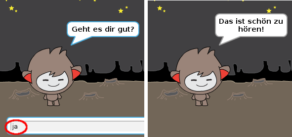
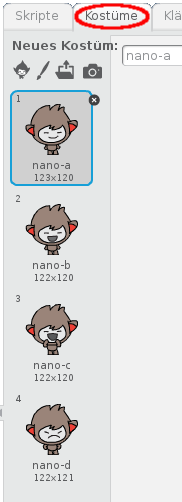
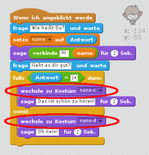
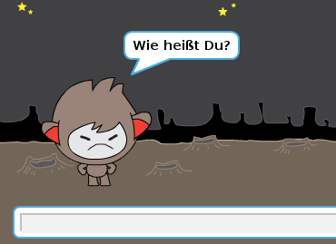
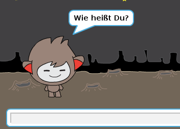

## Schritt 3: Entscheidungen treffen

Du kannst deinen Chatbot dazu programmieren, aufgrund deiner Antworten auf seine Fragen zu entscheiden, was er sagt oder tut.

\--- task \---

Kannst Du den Chatbot dazu programmieren, die Frage "Geht es dir gut?" zu stellen und dann mit "Das ist schön zu hören!" zurück zu antworten, aber nur **falls** die Antwort des Anwenders "ja" ist?

Um deinen neuen Code korrekt zu testen, solltest Du ihn **zweimal** ausprobieren, einmal mit der Antwort "ja" und einmal mit "nein".

Dein Chatbot sollte antworten "Das ist schön zu hören!" wenn Du "ja" antwortest, aber nichts sagen, wenn Du "nein" antwortest.

\--- hints \--- \--- hint \--- Nachdem dein Chatbot "Hi" gesagt hat, sollte er nun **fragen**: "Geht es dir gut?". **Falls** Du mit "ja" antwortest, sollte der Chatbot "Das ist schön zu hören!" **sagen**. \--- /hint \--- \--- hint \--- Hier sind die zusätzlichen Code-Blöcke, die Du brauchen wirst:  \--- /hint \--- \--- hint \--- So sollte dein Code aussehen:  \--- /hint \--- \--- /hints \---

\--- /task \---

\--- task \---

Im Moment sagt dein Chatbot nichts, wenn du mit "nein" antwortest. Kannst du deinen Chatbot so verändern, dass er auch, wenn du seine Frage mit "nein" beantwortest, zurück antwortet - mit "Oh nein!"?

Testen und speichern. Dein Chatbot sollte jetzt "Oh nein!" Sagen wenn Du mit "nein" antwortest. Er wird sogar "Oh nein!" sagen, wenn Du mit irgendetwas außer "ja" antwortest. (Das **sonst** im `falls/sonst`-Block bedeutet **in allen anderen Fällen**.)

\--- hints \--- \--- hint \--- Dein Chatbot sollte jetzt sagen: "Das ist schön zu hören!" **falls** Du mit "ja" antwortest, sollte aber "Oh nein!" sagen, falls Du **sonst**etwas antwortest. \--- /hint \--- \--- hint \--- Hier sind die Code-Blöcke, die Du brauchen wirst:  \--- /hint \--- \--- hint \--- So sollte dein Code aussehen:  \--- /hint \--- \--- /hints \---

\--- /task \---

\--- task \---

Du kannst allen möglichen Code in einem `falls/sonst`-Block ablegen, nicht bloß Code, der deinen Chatbot sprechen lässt. Wenn Du im Medienbereich den **Kostüme**-Reiter für die Figur deines Chatbots anklickst, wirst Du sehen, dass sie mehrere Kostüme hat.

\--- /task \---

\--- task \---

Kannst du das Kostüm des Chatbots so anpassen, dass es zu deiner Antwort passt?

Testen und speichern. Du solltest sehen, dass sich das Gesicht deines Chatbots in Abhängigkeit von deiner Antwort verändert.

\--- hints \--- \--- hint \---Dein Chatbot sollte jetzt zusätzlich je nach der gegebenen Antwort **wechsle zu Kostüm** ausführen. \--- /hint \--- \--- hint \--- Hier sind die Code-Blöcke, die Du brauchen wirst:  \--- /hint \--- \--- hint \--- So sollte dein Code aussehen:  \--- /hint \--- \--- /hints \---

\--- /task \---

\--- task \---

Ist dir aufgefallen, dass das Kostüm deines Chatbots sich, seit Du das letzte Mal mit ihm sprachst, nicht mehr verändert hat? Kannst Du dieses Problem beheben?

Testen und speichern - Führe deinen Code aus und gebe "nein" ein, so dass dein Roboter traurig schaut. Wenn Du dein Programm erneut startest, sollte dein Chatbot wieder ein fröhliches Gesicht zeigen, bevor er nach deinem Namen fragt.

\--- hints \--- \--- hint \--- Wenn die **Figur angeklickt** wird, sollte dein Chatbot zuerst **wechsle zu Kostüm** "fröhliches Gesicht" ausführen. \--- /hint \--- \--- hint \--- Hier sind die zusätzlichen Code-Blöcke, die Du brauchen wirst:  \--- /hint \--- \--- hint \--- So sollte dein Code aussehen:  \--- /hint \--- \--- /hints \---

\--- /task \---

\--- challenge \---

## Zusätzliche Entscheidungen

Program your chatbot to ask another question - something with a "yes" or "no" answer. Can you make your chatbot respond to the answer?

 \--- /challenge \---