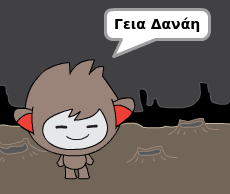
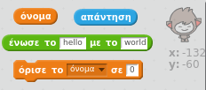
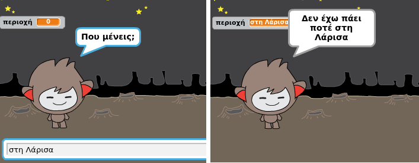

## Ένα ομιλόν chatbot

Τώρα που έχεις ένα chatbot με προσωπικότητα, ας το προγραμματίσεις για να σου μιλά.

+ Πρόσθεσε κώδικα στο chatbot έτσι ώστε όταν κάνεις κλικ, να ρωτά το όνομά σου και στη συνέχεια να λέει "Τι υπέροχο όνομα!"
    
    

[[[generic-scratch-saving]]]

\--- hints \--- \--- hint \--- Όταν το chatbot **αντικείμενο πατηθεί**, πρέπει **να ρωτήσει** για το όνομά σου. Το chatbot θα πρέπει τότε **να πει** "Τι υπέροχο όνομα!" \--- / hint \--- \--- hint \--- Εδώ είναι τα μπλοκ κώδικα που θα χρειαστείς:  \--- / hint \--- \--- hint \--- Έτσι πρέπει να είναι ο κώδικάς σου:  - - /hint \--- \--- /hints \---

+ Τώρα το chatbot απλά απαντά κάθε φορά "Τι υπέροχο όνομα!". Μπορείς να προσαρμόσεις την απάντηση του chatbot χρησιμοποιώντας την απάντησή σου;
    
    

\--- hints \--- \--- hint \--- Όταν το chatbot **sprite κάνει κλικ στο**, πρέπει **να ρωτήσει** για το όνομά σας. Το chatbot θα πρέπει στη συνέχεια **να λέει** "Γεια", ακολουθούμενο από την **απάντησή** σου. \--- /hint \--- \--- hint \--- Εδώ είναι τα μπλοκ κώδικα που θα χρειαστείς:  \--- /hint \--- \--- hint \--- Έτσι πρέπει να είναι ο κώδικάς σου:  \--- /hint \--- \--- /hints \---

+ Εάν αποθηκεύσεις την απάντησή σου σε μια **μεταβλητή**, τότε μπορεί να χρησιμοποιηθεί αργότερα. Δημιούργησε μία νέα μεταβλητή που ονομάζεται `όνομα` για να αποθηκεύσεις το όνομά σου.

[[[generic-scratch-add-variable]]]

+ Μπορείς να αποθηκεύσεις την απάντησή σου στη μεταβλητή `όνομα` και να την χρησιμοποιήσεις στην απάντηση του chatbot;
    
    Ο κώδικάς σου θα πρέπει να λειτουργεί όπως πριν: το chatbot σου θα πρέπει να πει "Γεια" χρησιμοποιώντας το όνομά σου.
    
    

\--- hints \--- \--- hint \--- Όταν το chatbot **αντικείμενο πατηθεί**, πρέπει **να ρωτήσει** για το όνομά σου. Στη συνέχεια, θα πρέπει να **ορίσεις** τη μεταβλητή `όνομα` στην **απάντησή** σου. Το chatbot θα πρέπει στη συνέχεια **να λέει** "Γεια", ακολουθούμενο από το **όνομά** σου. \--- /hint \--- \--- hint \--- Εδώ είναι τα μπλοκ κώδικα που θα χρειαστείς:  \--- /hint \--- \--- hint \--- Έτσι πρέπει να είναι ο κώδικάς σου:  \--- /hint \--- \--- /hints \---

\--- challenge \---

## Πρόκληση: περισσότερες ερωτήσεις

Προγραμμάτισε το chatbot για να κάνει άλλη μία ερώτηση. Μπορείς να αποθηκεύσεις την απάντηση σε μια νέα μεταβλητή;

 \--- /challenge \---