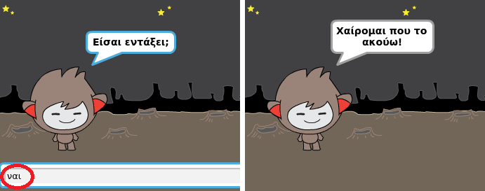
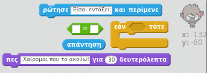
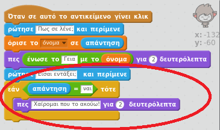
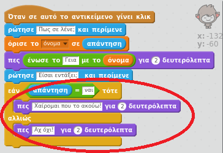
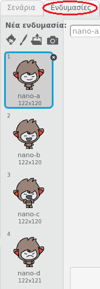
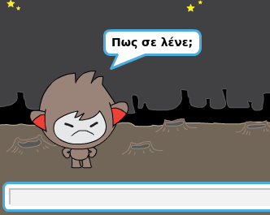
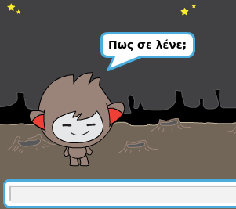
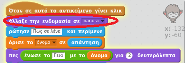

## Βήμα 3: Λαμβάνοντας αποφάσεις

Μπορείς να προγραμματίσεις το chatbot για να αποφασίσει τι να πει ή κάνει με βάση τις απαντήσεις στις ερωτήσεις του.

\--- task --

Μπορείς να κάνεις το chatbot να ρωτήσει "Είσαι εντάξει;" και να τον προγραμματίσεις να απαντήσει "Χαίρομαι που το ακούω!" μόνο **εάν** ο χρήστης απαντήσει "ναι";

Για να δοκιμάσεις κατάλληλα το νέο σου κώδικα, πρέπει να το δοκιμάσεις **δύο φορές**, μία φορά με την απάντηση "ναι" και μία φορά με την απάντηση "όχι".

Το chatbot σου θα πρέπει να απαντήσει "Χαίρομαι που το ακούω!" αν απαντήσεις "ναι", αλλά μην πει τίποτα αν απαντήσεις "όχι".

\--- hints \--- \--- hint \--- Μετά το chatbot σας είπε "Γεια", θα πρέπει τώρα επίσης **να ρωτήσετε** "Είστε εντάξει;". **Εάν** απαντήσεις "ναι", τότε το chatbot θα πρέπει **να πει** "Χαίρομαι που το ακούω!". \--- /hint \--- \--- hint \--- Εδώ είναι τα μπλοκ κώδικα που θα χρειαστείς:  \--- /hint \--- \--- hint \--- Έτσι πρέπει να είναι ο κώδικάς σου:  \--- /hint \--- \--- /hints \---

\--- /task \---

\--- task --

Αυτή τη στιγμή το chatbot σου δεν λέει τίποτα αν απαντήσεις "όχι". Μπορείς να αλλάξεις το chatbot σου ώστε να απαντήσει "Αχ όχι!" εάν απαντήσεις "όχι" στην ερώτησή του;

Δοκίμασε και αποθήκευσε. Το chatbot πρέπει τώρα να πει "Αχ όχι!" αν απαντήσεις "όχι". Στην πραγματικότητα, θα πει "Αχ όχι!" αν απαντήσεις με οτιδήποτε άλλο εκτός από "ναι" (το **αλλιώς** σε ένα `εάν/αλλιώς` μπλοκ σημαίνει **σε αντίθετη περίπτωση**).

\--- hints \--- \--- hint \--- Το chatbot σου θα πρέπει τώρα να πει "Χαίρομαι που το ακούω!" **εάν** η απάντησή σου είναι "ναι", αλλά θα πρέπει να πει "Αχ όχι!" αν απαντήσεις **αλλιώς**. \--- /hint \--- \--- hint \--- Εδώ είναι τα μπλοκ κώδικα που θα χρειαστείς:  \--- /hint \--- \--- hint \--- Έτσι πρέπει να είναι ο κώδικάς σου:  \--- /hint \--- \--- /hints \---

\--- /task \---

\--- task --

Μπορείς να τοποθετήσεις οποιονδήποτε κώδικα μέσα σε ένα `εάν/ αλλιώς` block, όχι μόνο κώδικα για να κάνεις το chatbot να μιλά. Αν κάνεις κλικ στην καρτέλα **Ενδυμασία** του chatbot, θα δεις ότι έχει περισσότερες από μία ενδυμασίες.

\--- /task \---

\--- task --

Μπορείς να αλλάξεις την ενδυμασία του chatbot ώστε να ταιριάζει με την απάντησή σου;

Δοκίμασε και αποθήκευσε. Θα πρέπει να δεις το πρόσωπο του chatbot να αλλάζει ανάλογα με την απάντησή σου.

\--- hints \--- \--- hint \--- Το chatbot θα πρέπει τώρα να **αλλάζει ενδυμασία** ανάλογα με την απάντηση. \--- /hint \--- \--- hint \--- Εδώ είναι τα μπλοκ κώδικα που θα χρειαστείς:  \--- /hint \--- \--- hint \--- Έτσι πρέπει να είναι ο κώδικάς σου:  \--- /hint \--- \--- /hints \---

\--- /task \---

\--- task --

Έχεις παρατηρήσει ότι η ενδυμασία του chatbot παραμένει η ίδια με την τελευταία φορά που μίλησες; Μπορείς να διορθώσεις αυτό το πρόβλημα;

Δοκίμασε και αποθήκευσε: Εκτελέσε τον κώδικά σου και πληκτρολόγησε "όχι", έτσι ώστε το chatbot σου να φαίνεται στεναχωρημένο. Όταν εκτελέσεις ξανά τον κώδικά σου, το chatbot πρέπει να έχει χαμογελαστό πρόσωπο πριν ρωτήσει το όνομά σου.

\--- hints \--- \--- hint \--- Όταν το **αντικείμενο πατηθεί**, το chatbot πρέπει πρώτα να **αλλάζει ενδυμασία** σε ένα χαμογελαστό πρόσωπο. \--- /hint \--- \--- hint \--- Εδώ είναι τα μπλοκ κώδικα που θα χρειαστείς:  \--- /hint \--- \--- hint \--- Έτσι πρέπει να είναι ο κώδικάς σου:  \--- /hint \--- \--- /hints \---

\--- /task \---

\--- challenge \---

## Πρόκληση: περισσότερες αποφάσεις

Προγραμμάτισε το chatbot για να κάνει μία άλλη ερώτηση - κάποια που να απαντάς με "ναι" ή "όχι". Μπορείς να κάνεις το chatbot να αντιδράσει στην απάντηση;

 \--- /challenge \---