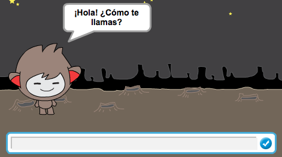
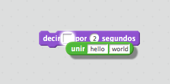

## Un robot que habla

Ahora que ya tienes un robot parlanchín con personalidad, vamos a programarlo para que te hable.

+ Haz clic en el personaje de tu robot parlanchín, y añade este código:

	```blocks
		al hacer clic en este objeto
		preguntar [¡Hola! ¿Cómo te llamas?] y esperar
		decir [¡Qué nombre más bonito!] por (2) segundos
	```

+ Haz clic en tu robot parlanchín para probarlo. Después de que te haya preguntado tu nombre, escríbelo en el recuadro que aparece en la parte inferior del escenario.

	

+ Tu robot parlanchín simplemente responderá `¡Qué nombre más bonito!` cada vez. Puedes personalizar la respuesta de tu robot parlanchín, usando la respuesta del usuario. Cambia el código del robot parlanchín a éste:

	```blocks
		al hacer clic en este objeto
		preguntar [¡Hola! ¿Cómo te llamas?] y esperar
		decir <unir [Hola] (respuesta)> por (2) segundos
	```

	Para crear este último bloque, primero tendrás que seleccionar un bloque verde `unir`{:class="blockoperators"}, y arrastrarlo sobre el bloque `decir`{:class="blocklooks"} .

	

	Puedes cambiar el texto `hello` por `Hola`, y arrastrar el bloque azul `respuesta`{:class="blocksensing"} (de la sección 'Sensores') sobre el texto `world`.

	

+ Prueba este nuevo programa. ¿Funciona como esperabas? ¿Puedes solucionar los problemas que ves? (Pista: ¡puedes intentar añadir un espacio en alguna parte!)

+ Puede que quieras guardar el nombre del usuario en una variable, para poder usarlo de nuevo en el futuro. Crea una nueva variable que se llame `nombre`{:class="blockdata"}. Si has olvidado cómo se hace, el proyecto "Globos" puede ayudarte.

+ La información que has escrito ya está almacenada en una variable especial llamada `respuesta`{:class="blocksensing"}. Ve a la sección de bloques Sensores y haz clic en el bloque de respuesta para que aparezca una marca de verificación. El valor actual en `respuesta`{:class="blocksensing"} debería aparecer en la parte superior izquierda del escenario.

+ Una vez hayas creado tu nueva variable, asegúrate de que el código de tu robot parlanchín sea como éste:

	```blocks
		al hacer clic en este objeto
		preguntar [¡Hola! ¿Cómo te llamas?] y esperar
		fijar [nombre v] a (respuesta)
		decir <unir [Hola ] (nombre)> por (2) segundos
	```

+ Si pruebas el programa una vez más, verás que la respuesta se guarda en la variable `nombre`{:class="blockdata"}, y aparece en la parte superior izquierda del escenario. La variable `nombre`{:class="blockdata"} debería ahora contener el mismo valor que la variable `respuesta`{:class="blocksensing"} .

	

	Si prefieres no ver las variables en el escenario, puedes desactivar la marca de verificación junto al nombre de la variable en la pestaña "Programas" para esconderla.

--- challenge ---
## Desafío: Más preguntas

Programa a tu robot parlanchín para que haga otra pregunta. ¿Puedes guardar la respuesta en una variable?


--- /challenge ---
