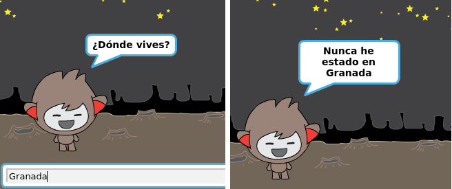

## Un chatbot parlanchín

Ahora que tienes un chatbot con personalidad, vamos a programarlo para que hable contigo.

\--- task \---

Add code to your chatbot so that when it's clicked, it asks for your name and then says "What a lovely name!"

\--- hints \--- \--- hint \--- When the chatbot **sprite is clicked**, it should **ask** for your name. The chatbot should then **say** "What a lovely name!" \--- /hint \--- \--- hint \--- Here are the code blocks you'll need:  \--- /hint \--- \--- hint \--- Here's how your code should look:  \--- /hint \--- \--- /hints \---

\--- /task \---

\--- task \---

Now the chatbot simply replies "What a lovely name!" every time. Can you personalise your chatbot's reply by making use of your answer?

\--- hints \--- \--- hint \--- When the chatbot **sprite is clicked**, it should **ask** for your name. The chatbot should then **say** "Hi", followed by your **answer**. \--- /hint \--- \--- hint \--- Here are the code blocks you'll need:  \--- /hint \--- \--- hint \--- Here's how your code should look:  \--- /hint \--- \--- /hints \---

\--- /task \---

\--- task \---

If you store your answer in a **variable**, then it can be used later. Create a new variable called `name` to store your name.

[[[generic-scratch-add-variable]]]

\--- /task \---

\--- task \---

Can you store your answer in the `name` variable and use it in your chatbot's reply?

Your code should work as before: your chatbot should say hello using your name.

\--- hints \--- \--- hint \--- When the chatbot **sprite is clicked**, it should **ask** for your name. You should then **set** the `name` variable to your **answer**. The chatbot should then **say** "Hi", followed by your **name**. \--- /hint \--- \--- hint \--- Here are the code blocks you'll need:  \--- /hint \--- \--- hint \--- Here's how your code should look:  \--- /hint \--- \--- /hints \---

\--- /task \---

\--- challenge \---

## Desafío: más preguntas

Program your chatbot to ask another question. Can you store the answer in a new variable?

 \--- /challenge \---