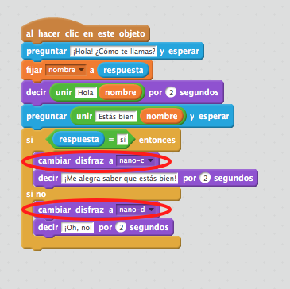

## Tomar decisiones

Puedes programar a tu robot parlanchín para que decida qué hacer, en función de las respuestas del usuario.

+ Vamos a hacer que tu robot parlanchín haga al usuario una pregunta con respuesta `sí` o `no`. Aquí te damos un ejemplo, pero puedes cambiar la pregunta si quieres:

	```blocks
		al hacer clic en este objeto
		preguntar [¡Hola! ¿Cómo te llamas?] y esperar
		fijar [nombre v] a (respuesta)
		decir <unir [Hola ] (nombre)> por (2) segundos
		preguntar <unir [¿Estás bien ] (nombre)> y esperar
		si ((respuesta)=[sí]) entonces
			decir [¡Me alegra saber que estás bien!] por (2) segundos
		fin
	```

	Fíjate que ahora que has guardado el nombre del usuario en una variable, puedes usarlo tantas veces como quieras.

+ Para probar el programa adecuadamente, tendrás que probarlo dos veces, una escribiendo `no` como tu respuesta, y otra escribiendo `sí`. Sólo deberías obtener una respuesta de tu robot parlanchín `si` {.blockcontrol} tu respuesta es `sí`.

+ El problema con tu robot parlanchín es que no te responde si el usuario contesta `no`. Puedes solucionar esto cambiando el bloque `si` {.blockcontrol} por un bloque `si/si no` {.blockcontrol}, para que tu nuevo código sea como éste:

	```blocks
		al hacer clic en este objeto
		preguntar [¡Hola! ¿Cómo te llamas?] y esperar
		fijar [nombre v] a (respuesta)
		decir <unir [Hola ] (nombre)> por (2) segundos
		preguntar <unir [Estás bien ] (nombre)> y esperar
		si ((respuesta)=[sí]) entonces
			decir [¡Me alegra saber que estás bien!] por (2) segundos
		si no
			decir [¡Oh, no!] por (2) segundos
		fin
	```

+ Si pruebas tu código, verás que ahora obtienes una respuesta si contestas `sí` o `no`. Tu robot parlanchín debería responder con `¡Me alegra saber que estás bien!` cuando contestas `sí`, pero responderá `¡Oh, no!` si escribes otra cosa que no sea `sí` (`si no` {.blockcontrol} aquí significa "de otra manera").

	

+ Puedes poner cualquier código dentro de un bloque `si` {.blockcontrol} o `si no` {.blockcontrol}, no sólo código para hacer que tu robot parlanchín hable. Por ejemplo, puedes cambiar el disfraz de tu robot parlanchín para que coincida con su respuesta.

	Si miras los disfraces de tu robot parlanchín, verás que hay más de uno. (Si no los hay, ¡siempre puedes añadir más tu mismo!)

	

	Puedes usar estos disfraces como parte de la respuesta de tu robot parlanchín, añadiendo este código:

	

+ Prueba tu programa, y deberías ver cómo la cara de tu robot parlanchín cambia dependiendo de la respuesta que le das.

	

--- challenge ---
## Desafío: Más decisiones

Programa a tu robot parlanchín para que haga otra pregunta, algo cuya respuesta sea `sí` o `no` . ¿Puedes hacer que tu robot parlanchín conteste a la respuesta?


--- /challenge ---
