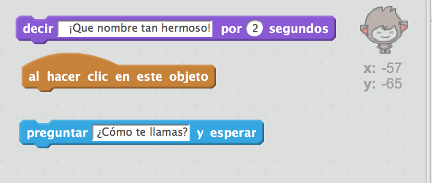
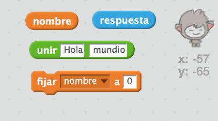
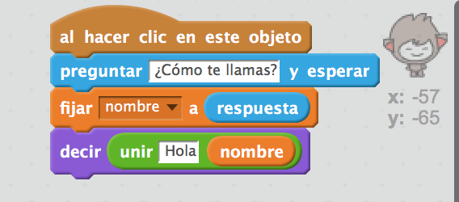

## Un chatbot parlanchín

Ahora que tienes un chatbot con personalidad, vamos a programarlo para que hable contigo.

\--- task \---

Agrega código a tu chatbot para que cuando se haga clic en él, te pida tu nombre y luego diga "¡Qué nombre más bonito!"

\--- hints \--- \--- hint \--- Cuando se haga **clic en la figura** del chatbot, debería **preguntarte** por tu nombre. Luego el chatbot debería **decir** "Que nombre más bonito!" \--- /hint \--- \--- hint \--- Estos son los bloques de código que vas a necesitar:  \--- /hint \--- \--- hint \--- Tu código debería quedar así:  \--- /hint \--- \--- /hints \---

\--- /task \---

\--- task \---

Ahora el chatbot simplemente responde "¡Qué nombre más bonito!" cada vez. ¿Puedes personalizar la respuesta de tu chatbot haciendo uso de tu respuesta?

\--- hints \--- \--- hint \--- Cuando se hace **clic en la figura** del chatbot, este debería **preguntarte** por tu nombre. El chatbot debería entonces **decir** "Hola", seguido de tu **respuesta**. \--- /hint \--- \--- hint \--- Estos son los bloques de código que vas a necesitar:  \--- /hint \--- \--- hint \--- Tu código debería ser así:  \--- /hint \--- \--- /hints \---

\--- /task \---

\--- task \---

Si guardas tu respuesta en una **variable**, se podrá usar más tarde. Crea una nueva variable llamada `nombre` para guardar tu nombre.

[[[generic-scratch-add-variable]]]

\--- /task \---

\--- task \---

¿Puedes almacenar tu respuesta en la variable `nombre` y usarla en la respuesta de tu chatbot?

Tu código debería funcionar como antes: tu chatbot te debería saludar usando tu nombre.

\--- hints \--- \--- hint \--- Cuando se hace clic **clic en la figura** del chatbot, este debería **preguntar** por tu nombre. Entonces deberías **fijar** la variable `nombre` al contenido de tu **respuesta**. El chatbot debería entonces **decir** "Hola", seguido de tu **nombre**. \--- /hint \--- \--- hint \--- Estos son los bloques de código que vas a necesitar:  \--- /hint \--- \--- hint \--- Tu código debería quedar así:  \--- /hint \--- \--- /hints \---

\--- /task \---

\--- challenge \---

## Desafío: más preguntas

Programa tu chatbot para hacer otra pregunta. ¿Puedes almacenar la respuesta en una nueva variable?

 \--- /challenge \---