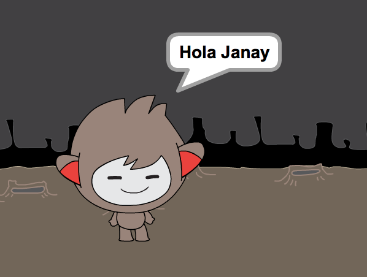

## Un chatbot parlanchín

Ahora que tienes un chatbot con personalidad, vamos a programarlo para que hable contigo.

+ Agrega código a tu chatbot para que cuando se haga un clic en él, te pida tu nombre y luego diga "¡Qué hermoso nombre!"
    
    

[[[generic-scratch-saving]]]

\--- hints \--- \--- hint \--- Cuando se hace clic **en el chatbot**, debería **preguntar** por tu nombre. El chatbot debería entonces ** decir ** "¡Que bonito nombre!" \--- / hint \--- \--- hint \--- Aquí están los bloques de código que necesitarás: <1 /> \--- / hint \--- \--- hint \--- Así es como debe ser tu código: <2 /> \--- / hint \--- \--- / hints \---

+ Ahora el chatbot simplemente responde "¡Qué bonito nombre!" cada vez. ¿Puedes personalizar la respuesta de tu chatbot haciendo uso de tu respuesta?
    
    

\--- hints \--- \--- hint \--- Cuando se hace clic **en el chatbot**, debería **preguntar** por tu nombre. El chatbot debería entonces ** decir ** "Hola", seguido de tu **respuesta **. \--- / hint \--- \--- hint \--- Aquí están los bloques de código que necesitarás: <0 /> \--- / hint \--- \--- hint \--- Así es como debe ser tu código: <1 /> \--- / hint \--- \--- / hints \---

+ Si almacenas tu respuesta en una **variable **, luego se puede usar más tarde. Crea una nueva variable llamada ` nombre ` para almacenar tu nombre.

[[[generic-scratch-add-variable]]]

+ ¿Puedes almacenar tu respuesta en la variable `nombre ` y usarlo en la respuesta de tu chatbot?
    
    Tu código debería funcionar como antes: tu chatbot debería decir hola usando tu nombre.
    
    

\--- hints \--- \--- hint \--- Cuando se hace un clic **en el chatbot**, debería **preguntar** por tu nombre. Entonces deberías ** fijar ** la variable ` nombre ` a tu ** respuesta**. El chatbot debería entonces ** decir ** "Hola", seguido de tu **nombre **. \--- / hint \--- \--- hint \--- Aquí están los bloques de código que necesitarás: <0 /> \--- / hint \--- \--- hint \--- Así es como debe ser tu código: <1 /> \--- / hint \--- \--- / hints \---

\--- challenge \---

## Desafío: más preguntas

Programa tu chatbot para hacer otra pregunta. ¿Puedes almacenar la respuesta en una nueva variable?

 \--- /challenge \---