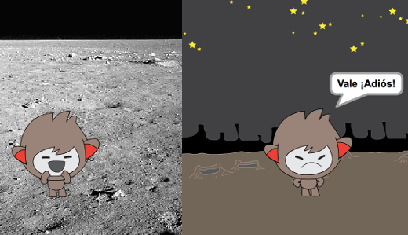
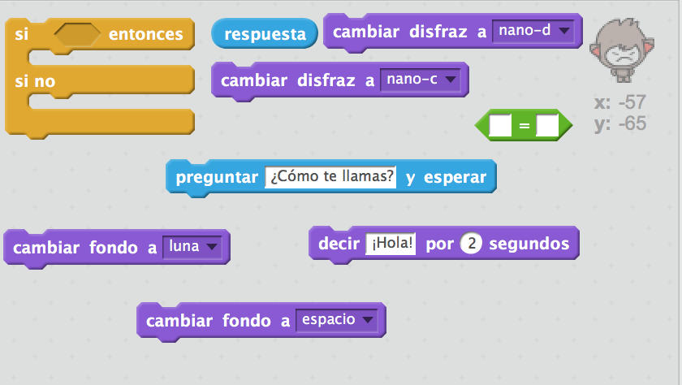
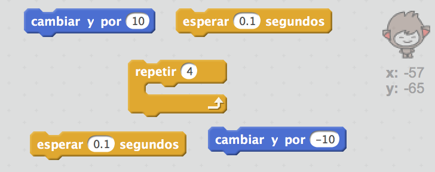
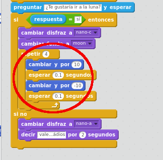

## Cambio de posición

También puedes codificar tu chatbot para cambiar su posición.

\--- task \---

Añade otro fondo a tu escenario, por ejemplo el fondo 'moon' (luna en inglés).

\--- /task \---

\--- task \---

¿Puedes añadir código a tu chatbot para preguntar "¿Te gustaría ir a la luna?" y luego cambiar de posición si respondes "sí"?

Prueba y guarda. Si respondes "sí", tu chatbot debería cambiar de ubicación. Si escribes cualquier otra respuesta, tu chatbot debería parecer triste y decir "OK ​​... ¡adiós!".

\--- hints \--- \--- hint \--- Tu chatbot debería **preguntar** "¿Te gustaría ir a la luna?". **Si** tu **respuesta** es "sí", entonces tu chatbot debería **cambiar de disfraz** para parecer feliz y el **telón de fondo** del escenario debería cambiar.

Si respondes "no", el chatbot debería **cambiar el disfraz** parecer triste y **decir** "¡OK...adios!"

También necesitarás agregar código para iniciar tu chatbot en el lugar correcto **cuando hagas clic en el**. \--- /hint \--- \--- hint \--- Estos son los bloques de código que necesitarás usar:  \--- /hint \--- \--- hint \--- Tu código debería quedar así:  \--- /hint \--- \--- /hints \---

\--- /task \---

\--- task \---

¿Puedes agregar código para que tu chatbot salte de alegría si le dices que quieres ir a la luna?

Prueba y guarda. Si respondes "sí", tu chatbot debería saltar arriba y abajo. Tu chatbot no debería saltar si das cualquier otra respuesta.

\--- hints \--- \--- hint \--- Tu chatbot debería saltar **cambiando** su **posición y** ligeramente, y luego volver a su posición inicial después de una corta **espera**. Es posible que quieras **repetir** esto algunas veces. \--- /hint \--- \--- hint \--- Estos son los bloques de código que necesitarás:  \--- /hint \--- \--- hint \--- Tu código debería quedar así:  \--- /hint \--- \--- /hints \---

\--- /task \---