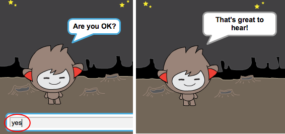
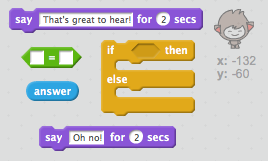

## Vaihe 3: Päätökset

Voit ohjelmoida chatbotsi päättää, mitä sanoa tai tehdä vastausten perusteella kysymyksiisi.

+ Voitteko tehdä chatbot kysyä "Oletko kunnossa?" Ja koodata sitä vastaamaan "Se on hienoa kuulla!" vain **jos** käyttäjä vastaa "kyllä"?
    
    Testaa uusi koodi kunnolla, kokeile sitä **kahdesti**, kerran vastauksella "kyllä" ja kerran vastauksella "ei".
    
    Chatbotisi pitäisi vastata "Se on hienoa kuulla!" jos vastaat "kyllä", mutta älä sano mitään, jos vastaat "ei".
    
    

\--- vinkit \--- \--- vinkki \--- Kun chatbot on sanonut "Hi", sen pitäisi nyt myös **kysyä** "Oletko kunnossa?". **Jos** vastaa "kyllä", chatbotin pitäisi **sanoa** "Se on hienoa kuulla!". \--- / hint \--- \--- vinkki \--- Tässä on tarvittavia ylimääräisiä koodilohkoja:  \--- / hint \--- \--- vinkki \--- Näin koodisi pitäisi näyttää:  \--- / hint \--- \--- / vinkit \---

+ Tällä hetkellä chatbot ei sano mitään, jos vastaat "ei". Voitko vaihtaa chatbota niin, että se vastaa myös "Oh no!" jos vastaat kysymykseenne "ei"?
    
    Testaa ja tallenna. Chatbotisi pitäisi nyt sanoa "Oh no!" jos vastaat "ei". Itse asiassa se sanoo "Ei!" jos vastaat muuta kuin "kyllä" ( **muuten** `jos / muut` estää **muuten**).
    
    

\--- vinkkejä \--- \--- vinkka \--- Sinun chatbot pitäisi nyt sanoa "Se on hienoa kuulla!" **jos** vastauksesi on "kyllä", mutta sen pitäisi sanoa "Oh no!" jos vastaat jotain **muuten**. \--- / hint \--- \--- vinkki \--- Tässä on koodilohkot, joita sinun on käytettävä:  \--- / hint \--- \--- vinkki \--- Näin sinun koodisi pitäisi näyttää:  \--- / hint \--- \--- / vinkit \---

+ Voit laittaa minkä tahansa koodin `if / else` -lohkoon, ei pelkästään koodiin, jotta chatbotisi puhuisi. Jos napsautat chatbotin **Puku** -välilehteä, näet, että sillä on useampi kuin yksi puku.
    
    

+ Voitko vaihtaa chatbotin puku vastaamaan vasteesi?
    
    Testaa ja tallenna. Sinun pitäisi nähdä chatbotin kasvot vaihtelevat vastauksen mukaan.
    
    

\--- vinkit \--- \--- vinkka \--- Chatbotisi pitäisi nyt myös **vaihtaa puku** riippuen annetusta vastauksesta. \--- / hint \--- \--- vinkki \--- Tässä on koodilohkot, joita sinun on käytettävä:  \--- / hint \--- \--- vinkki \--- Näin sinun koodisi pitäisi näyttää:  \--- / hint \--- \--- / vinkit \---

+ Oletko huomannut, että chatbotin puku pysyy samana, että se muuttui viimeksi kun puhut siihen? Voitko korjata tämän ongelman?
    
    
    
    Testaa ja tallenna: Suorita koodisi ja kirjoita "ei", jotta chatbotisi näyttää onnettomalta. Kun käytät koodia uudelleen, chatbot-tilisi tulee vaihtaa hymyileviin kasvoihin ennen kuin kysyy nimeäsi.
    
    

\--- vinkit \--- \--- vinkki \--- Kun **spriteä napsautetaan**, chatbotin tulee ensin **vaihtaa puku** hymyileviin kasvoihin. \--- / hint \--- \--- vinkki \--- Tässä on koodilohko, jonka sinun on lisättävä:  \--- / hint \--- \--- vinkki \--- Näin koodisi pitäisi näyttää:  \--- / hint \--- \--- / vinkit \---

\--- haaste \---

## Haaste: enemmän päätöksiä

Voit ohjelmoida chatbotisi kysymään toisen kysymyksen - jotain "kyllä" tai "ei" vastausta. Voitteko soittaa chatbotisi vastaamaan vastaukseen?

 \--- /haaste \---