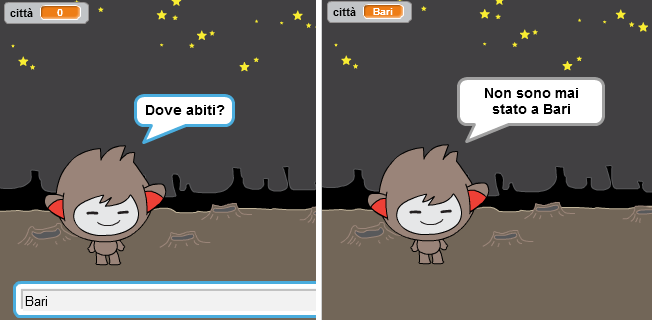

## Un chatterbot parlant

Adesso che hai un chatterbot con la sua personalità, programmiamolo per farlo parlare.

+ Clicca sul tuo personaggio chatterbot e aggiungi questo codice:

	```blocks
		quando si clicca questo sprite
		chiedi [Ehi! Come ti chiami?] e attendi
		dire [Che bel nome!] per (2) secondi
	```

+ Clicca sul tuo chatterbot per testarlo. Dopo che ti verrà chiesto il nome, digitalo nella casella al fondo del quadro.

	

+ Il tuo chatterbot risponderà semplicemente 'Che bel nome!' ogni volta. Puoi personalizzare la risposta del chatterbot, usando le risposte dell'utente. Cambia il codice del chatterbot, in modo che sia così:

	```blocks
		quando si clicca questo sprite
		chiedi [Ehi! Come ti chiami?] e attendi
		dire (unione di [Ciao] e (risposta)) per (2) secondi
	```

	Per creare l'ultimo blocco, dovrai prima trascinare un blocco `unione`{:class="blockoperators"} verde, e poi trascinarlo sul blocco `dire`{:class="blocklooks"}.

	

	Poi, puoi cambiare il testo 'hello' per dire 'Ciao', e trascinare il blocco azzurro `risposta`{:class="blocksensing"} (dalla sezione 'Sensori') sul testo 'world'.

	

+ Prova questo nuovo programma. Funziona come previsto? Se noti dei problemi, sai come risolverli? (Suggerimento: puoi provare ad aggiungere uno spazio dove vuoi!)

+ Puoi anche volere salvare il nome dell'utente in una variabile, in modo che tu possa usarlo di nuovo. + Crea una nuova variabile chiamata `nome`{:class="blockdata"}. Se non ti ricordi come si fa, il progetto 'Ghostbusters' ti aiuterà.

+ L'informazione che hai inserito è già salvata in una variabile speciale chiamata `risposta`{:class="blocksensing"}.  Vai al gruppo di blocchi Sensori e clicca il blocco di risposta in modo da far apparire una spunta. L'attuale valore in `risposta`{:class="blocksensing"} dovrebbe essere visualizzato in alto a sinistra del quadro.

+ Una volta creata la tua nuova variabile, assicurati che il codice del tuo chatterbot sia così:

	```blocks
		quando si clicca questo sprite
		chiedi [Ehi! Come ti chiami?] e attendi
		porta [nome v] a (risposta)
		dire (unione di [Ciao ] e (nome)) per (2) secondi
	```

+ Se testi di nuovo il programma, noterai che la risposta è salvata nella variabile `nome`{:class="blockdata"}, ed è visualizzata in alto a sinistra del quadro.  La variabile `nome`{:class="blockdata"} adesso dovrebbe contenere lo stesso valore della variabile `risposta`{:class="blocksensing"}.

	

	Se preferisci non vedere le variabili sul quadro, puoi cliccare la spunta accanto alle variabili dei nomi nel tab 'Scritte' per nasconderle.

--- challenge ---
## Sfida: Altre domande

Programma il tuo chatterbot a fare un'altra domanda. Riesci a salvare la sua risposta in una variabile?


--- /challenge ---
