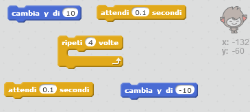

## Cambiare posizione

Puoi anche programmare il tuo ChiacchieRobot a cambiare la sua posizione.

\--- task \---

Aggiungi un altro scenario al tuo quadro, per esempio lo scenario ‘luna’.

\--- /task \---

\--- task \---

Sapresti programmare il tuo ChiacchieRobot in modo che ti chieda "Vado sulla luna. Vuoi venire con me?" e cambi la sua posizione se la tua risposta è "sì"?

Prova il tuo codice e salvalo. Se rispondi "sì", il ChiacchieRobot dovrebbe cambiare posizione. Se dai altre risposte, il ChiacchieRobot dovrebbe essere triste e dire "Ok... Addio!".

\--- hints \--- \--- hint \--- Il tuo ChiacchieRobot dovrebbe **chiedere** "Vado sulla luna. Vuoi venire con me?". **Se** la tua **risposta** è "sì", il tuo ChiacchieRobot dovrebbe **cambiare costume** ed essere felice, e lo **sfondo** dovrebbe cambiare.

Se la tua risposta è "no", il tuo ChiacchieRobot dovrebbe **cambiare costume** ed essere triste, e **dire** "Ok... Addio!"

Devi anche assicurarti che il tuo ChiacchieRobot si trovi al posto giusto quando **inizia a parlare**. Aggiungi un blocco in cima al codice del ChiacchieRobot. \--- /hint \--- \--- hint \--- Ecco i blocchi di codice di cui avrai bisogno:  \--- /hint \--- \--- hint \--- Ecco come dovrebbe apparire il tuo codice:  \--- /hint \--- \--- /hints \---

\--- /task \---

\--- task \---

Potresti aggiungere dei blocchi per far sì che il tuo ChiacchieRobot saltelli di felicità se gli dici che vuoi andare sulla luna?

Prova il tuo codice e salvalo. Se la tua risposta è "sì", il ChiacchieRobot dovrebbe saltare su e giù. Se la tua risposta è un'altra, il ChiacchieRobot non dovrebbe saltare.

\--- hints \--- \--- hint \--- Il tuo ChiacchieRobot dovrebbe saltare **cambiando** la sua **posizione y** di poco, e cambiandola di nuovo dopo una breve **attesa**. Ti consigliamo di **ripetere** questa operazione un paio di volte. \--- /hint \--- \--- hint \--- Ecco i blocchi di codice di cui avrai bisogno:  \--- /hint \--- \--- hint \--- Ecco come dovrebbe apparire il tuo codice:  \--- /hint \--- \--- /hints \---

\--- /task \---