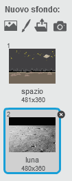

## Cambiare posizione

Puoi anche programmare il tuo ChiacchieRobot a cambiare la sua posizione.

\--- task \---

Aggiungi un altro scenario al tuo quadro, per esempio lo scenario ‘luna’.

\--- /task \---

\--- task \---

Sapresti programmare il tuo ChiacchieRobot in modo che ti chieda "Vado sulla luna. Vuoi venire con me?" e cambi la sua posizione se la tua risposta è "sì"?

Prova il tuo codice e salvalo. Se rispondi "sì", il ChiacchieRobot dovrebbe cambiare posizione. Se dai altre risposte, il ChiacchieRobot dovrebbe essere triste e dire "Ok... Addio!".

\--- hints \--- \--- hint \--- Il tuo ChiacchieRobot dovrebbe **chiedere** "Vado sulla luna. Vuoi venire con me?". **Se** la tua **risposta** è "sì", il tuo ChiacchieRobot dovrebbe **cambiare costume** ed essere felice, e lo **sfondo** dovrebbe cambiare.

Se la tua risposta è "no", il tuo ChiacchieRobot dovrebbe **cambiare costume** ed essere triste, e **dire** "Ok... Addio!"

Devi anche assicurarti che il tuo ChiacchieRobot si trovi al posto giusto quando **inizia a parlare**. Aggiungi un blocco in cima al codice del ChiacchieRobot. \--- /hint \--- \--- hint \--- Ecco i blocchi di codice di cui avrai bisogno:  \--- /hint \--- \--- hint \--- Ecco come dovrebbe apparire il tuo codice:  \--- /hint \--- \--- /hints \---

\--- /task \---

\--- task \---

Potresti aggiungere dei blocchi per far sì che il tuo ChiacchieRobot saltelli di felicità se gli dici che vuoi andare sulla luna?

Test and save. If you answer "yes", your chatbot should jump up and down. Your chatbot shouldn't jump if any other answer is given.

\--- hints \--- \--- hint \--- Your chatbot should jump by **changing** its **y position** by a small amount, and then changing its position back after a short **wait**. You may want to **repeat** this a few times. \--- /hint \--- \--- hint \--- Here are the code blocks you'll need to use:  \--- /hint \--- \--- hint \--- Here's how your code should look:  \--- /hint \--- \--- /hints \---

\--- /task \---