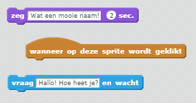
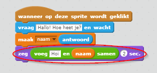
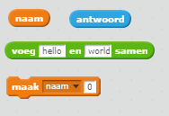
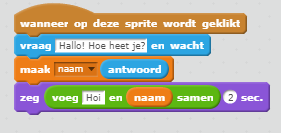
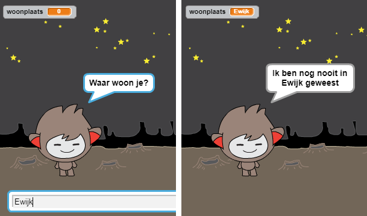

## Een pratende chatbot

Nu dat je een chatbot met een persoonlijkheid hebt, ga je het programmeren om met je te praten.

\--- task \---

Voeg code toe aan je chatbot, zodat wanneer je er op klikt, deze naar je naam vraagt ​​en vervolgens zegt: "Wat een mooie naam!"

\--- hints \--- \--- hint \--- Wanneer op de chatbot **sprite wordt geklikt**, moet het naar je naam **vragen**. De chatbot moet dan **zeggen** "wat een mooie naam!" \--- /hint \--- \--- hint \--- Dit zij de code blokken die je nodig hebt:  \--- /hint \--- \--- hint \--- Zo zou je code er moeten uitzien:  \--- /hint \--- \--- /hints --

\--- /task \---

\--- task \---

Nu antwoordt de chatbot elke keer met "Wat een mooie naam!". Kunt je het antwoord van je chatbot personaliseren door gebruik te maken van je antwoord?

\--- hints \--- \--- hint \--- Wanneer op de chatbot **sprite wordt geklikt**, moet het naar je naam **vragen**. De chatbot zou dan **moeten zeggen** "Hallo", gevolgd door je **antwoord**. \--- /hint \--- \--- hint \--- Dit zij de code blokken die je nodig hebt:  \--- /hint \--- \--- hint \--- Zo zou je code er moeten uitzien:  \--- /hint \--- \--- /hints \---

\--- /task \---

\--- task \---

Als je jouw antwoord opslaat in een **variabele**, dan kan dit later worden gebruikt. Maak een nieuwe variabele genaamd `naam` aan om je antwoord in op te slaan.

[[[generic-scratch-add-variable]]]

\--- /task \---

\--- task \---

Kun je je antwoord opslaan in de `naam` variabele en het gebruiken in het antwoord van je chatbot?

Je code zou moeten werken zoals voorheen: je chatbot zou hallo en je naam moeten zeggen.

\--- hints \--- \--- hint \--- Wanneer op de chatbot **sprite wordt geklikt**, moet het naar je naam **vragen**. **Maak** je `naam` variabele gelijk aan je **antwoord**. De chatbot zou dan **moeten zeggen** "Hallo", gevolgd door je **antwoord**. \--- /hint \--- \--- hint \--- Dit zij de code blokken die je nodig hebt:  \--- /hint \--- \--- hint \--- Zo zou je code er moeten uitzien:  \--- /hint \--- \--- /hints \---

\--- /task \---

\--- challenge \---

## Challenge: meer vragen

Programmeer je chatbot om een ​​andere vraag te stellen. Kun je het antwoord opslaan in een nieuwe variabele?

 \--- /challenge \---